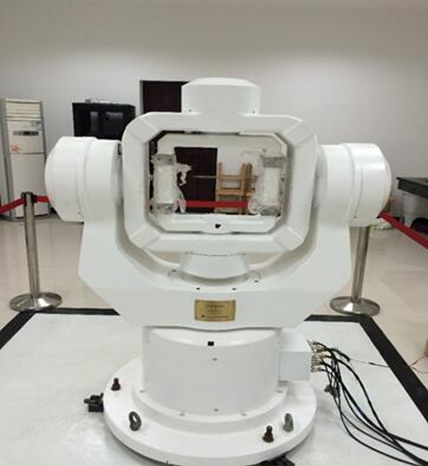
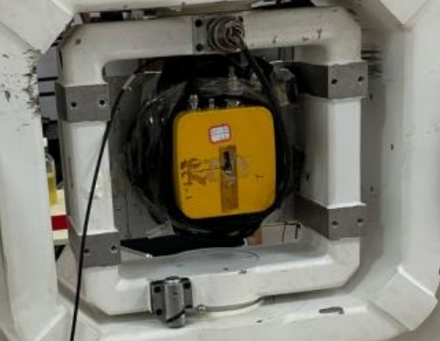
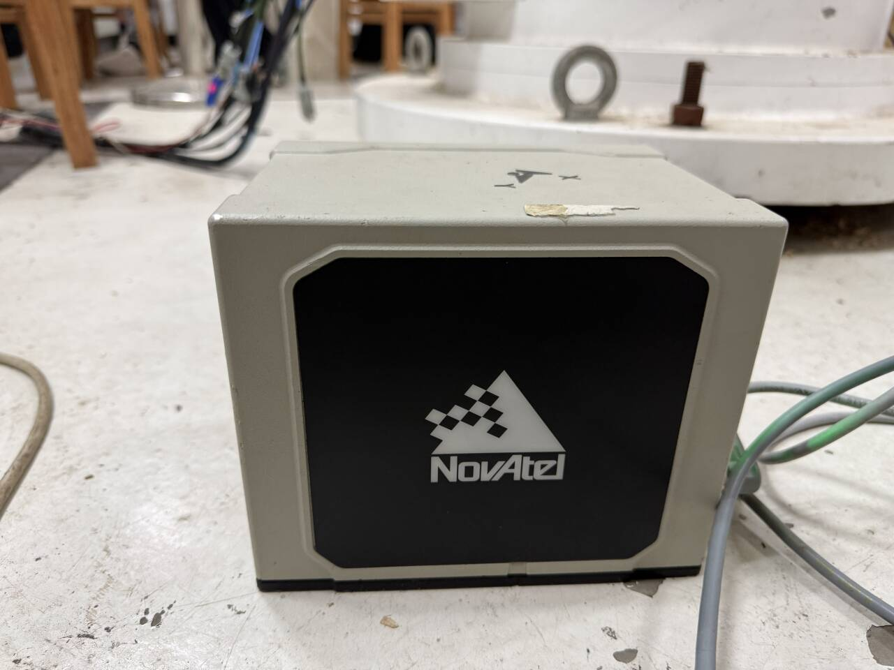
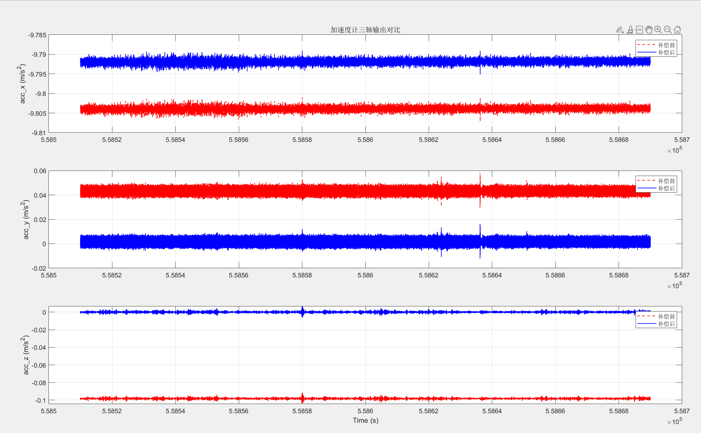
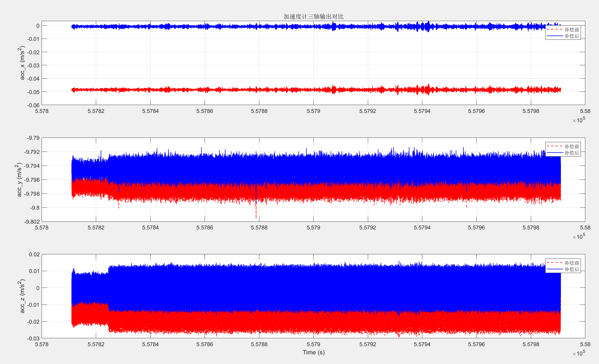
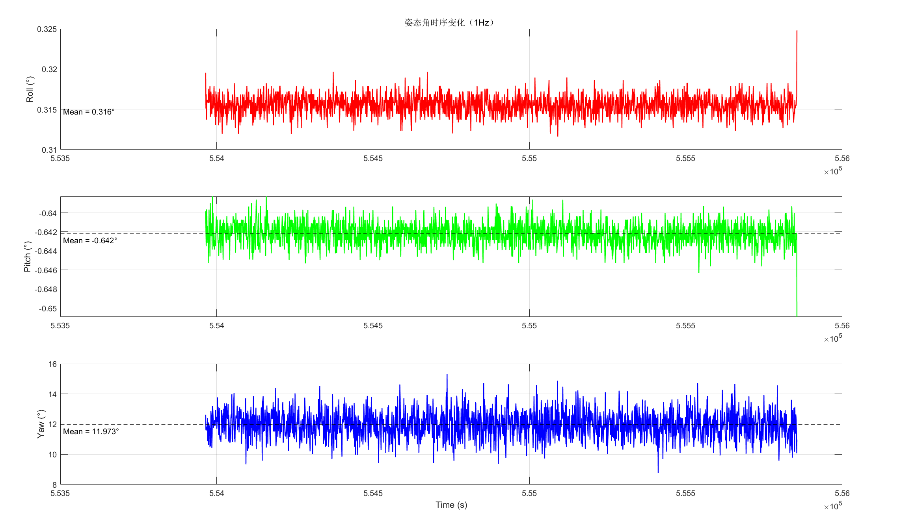

# IMU Calibration and Initial Alignment

<div align="center">


</div>

## 📌 项目简介

本项目面向惯性导航系统中的 **IMU 标定与初始对准** 实验，主要完成加速度计六位置法标定、陀螺角位置法标定、误差参数补偿以及静态解析粗对准。

项目通过处理 IMU 原始数据，估计加速度计和陀螺仪的零偏、比例因子误差和非正交误差，并将误差参数补偿回原始观测数据中，从而提高 IMU 输出数据的准确性和一致性。同时，项目利用静态状态下的重力矢量和地球自转角速度矢量，完成 IMU 初始姿态角解算，为后续惯性导航和组合导航算法提供可靠初值。

---

## 🧭 项目内容

本项目主要包括两个部分：

### 1. IMU 误差标定

- 加速度计六位置法标定
- 陀螺仪角位置法标定
- 零偏误差估计
- 比例因子误差估计
- 非正交耦合误差估计
- 标定参数补偿
- 补偿前后数据对比分析

### 2. IMU 初始对准

- 静态 IMU 数据读取与预处理
- 基于重力矢量和地球自转角速度的解析粗对准
- 姿态矩阵构建
- 横滚角、俯仰角、航向角解算
- 全历元平均、1 Hz 平均和逐历元对准结果对比

---

## 🧪 实验设备

本实验主要使用高精度三轴转台、星网宇达 XW-GI7681 IMU 和 NovAtel SPAN-100C IMU。

<div align="center">



<br>

<b>高精度三轴转台</b>

</div>

<br>

<div align="center">



<br>

<b>星网宇达 XW-GI7681 IMU</b>

</div>

<br>

<div align="center">



<br>

<b>NovAtel SPAN-100C IMU</b>

</div>

---

## 📂 项目结构

本项目代码主要分为 **IMU Calibration** 和 **IMU Alignment** 两个模块。

```text
.
├── IMU Calibration/                  # IMU 标定模块
│   ├── Calibration.cpp               # 加速度计与陀螺仪标定主算法
│   ├── Error_compensation.cpp        # 误差补偿程序
│   ├── Segment.cpp                   # 数据截取与分段处理
│   ├── data_parse.cpp                # IMU 数据解析
│   ├── main.cpp                      # 标定程序入口
│   ├── Myheadfile.h                  # 头文件与函数声明
│   ├── IMU Calibration.vcxproj       # Visual Studio 工程文件
│   ├── IMU Calibration.vcxproj.filters
│   └── IMU Calibration.vcxproj.user  # 用户本地配置文件，建议不上传
│
├── IMU Alignment/                    # IMU 初始对准模块
│   ├── Alignment.cpp                 # 静态解析粗对准算法
│   ├── main.cpp                      # 对准程序入口
│   ├── main_second.cpp               # 按秒平均数据进行对准
│   ├── main_epoch.cpp                # 按历元数据进行对准
│   ├── struct_const.h                # 常量、结构体与参数定义
│   ├── IMU Alignment.vcxproj         # Visual Studio 工程文件
│   ├── IMU Alignment.vcxproj.filters
│   └── IMU Alignment.vcxproj.user    # 用户本地配置文件，建议不上传
│
├── data/                             # 实验数据
│   ├── 标定/
│   │   ├── 原始数据/                  # 原始 IMU 数据
│   │   └── ASC/                      # 解码后的 ASC 数据
│   └── 对准/
│       └── Calibration_30min.ASC     # 30 min 静态初始对准数据
│
├── images/                           # README 展示图片
├── results/                          # 实验结果图与输出结果
├── .gitignore
└── README.md
```

> 注意：`x64/Debug/`、`.vcxproj.user` 等文件属于本地编译或用户配置文件，通常不建议上传到 GitHub。

---

## 📊 数据说明

### 1. 标定数据

标定数据位于：

```text
data/标定/
├── 原始数据/
└── ASC/
```

其中：

- `原始数据/`：保存实验采集得到的原始 IMU 数据；
- `ASC/`：保存经过解码和格式转换后的 ASC 数据，供程序读取和处理。

加速度计采用 **六位置法** 进行标定，分别采集三轴正反方向静止数据。

| 文件名 | 数据含义 | 用途 |
|---|---|---|
| `x_up_3min.ASC` | X 轴朝上静置 3 min | 加速度计六位置标定 |
| `x_down_3min.ASC` | X 轴朝下静置 3 min | 加速度计六位置标定 |
| `y_up_3min.ASC` | Y 轴朝上静置 3 min | 加速度计六位置标定 |
| `y_down_3min.ASC` | Y 轴朝下静置 3 min | 加速度计六位置标定 |
| `z_up_3min.ASC` | Z 轴朝上静置 3 min | 加速度计六位置标定 |
| `z_down_3min.ASC` | Z 轴朝下静置 3 min | 加速度计六位置标定 |

陀螺仪采用 **角位置法** 进行标定，分别绕各敏感轴正反转 360°。

| 文件名 | 数据含义 | 用途 |
|---|---|---|
| `x+360.ASC` | 绕 X 轴正转 360° | 陀螺零偏与比例因子估计 |
| `x-360.ASC` | 绕 X 轴反转 360° | 陀螺零偏与比例因子估计 |
| `y+360.ASC` | 绕 Y 轴正转 360° | 陀螺零偏与比例因子估计 |
| `y-360.ASC` | 绕 Y 轴反转 360° | 陀螺零偏与比例因子估计 |
| `z+360.ASC` | 绕 Z 轴正转 360° | 陀螺零偏与比例因子估计 |
| `z-360.ASC` | 绕 Z 轴反转 360° | 陀螺零偏与比例因子估计 |

### 2. 对准数据

对准数据位于：

```text
data/对准/
└── Calibration_30min.ASC
```

`Calibration_30min.ASC` 为 IMU 静止采集约 30 min 的观测数据，用于静态解析粗对准。程序分别采用以下三种方式计算初始姿态角：

- 全历元数据求均值后对准；
- 每秒数据求均值后对准；
- 每个历元单独计算姿态角。

> `Calibration_30min.ASC` 文件约 39 MB，GitHub 网页端可能无法直接上传。建议使用 Git 命令行上传，或者将完整数据放入 Git LFS / Release / 网盘，仓库中只保留小型示例数据。

---

## ⚙️ 方法原理

### 1. 加速度计六位置法标定

加速度计测量值中包含零偏、比例因子误差、非正交耦合误差和随机噪声。六位置法通过让 IMU 的 X、Y、Z 三个轴分别朝上和朝下静置，使加速度计在六个已知重力方向下采集数据。

通过六组静态观测数据，可以建立冗余观测方程，并采用最小二乘方法求解加速度计误差参数，包括：

- 三轴零偏误差；
- 三轴比例因子误差；
- 轴间非正交耦合误差。

### 2. 陀螺仪角位置法标定

陀螺仪标定通过控制三轴转台绕 IMU 各敏感轴正转和反转 360°，利用正反转角度积分结果的差异，计算陀螺仪的零偏和比例因子误差。

该方法可以有效削弱部分随机噪声和常值偏差的影响，适用于转台条件下的陀螺误差参数估计。

### 3. 误差补偿

完成误差参数估计后，将零偏、比例因子误差和非正交误差补偿回原始 IMU 数据中，得到更加准确和一致的传感器输出。

补偿后的数据可进一步用于惯导机械编排、初始对准和组合导航算法。

### 4. 静态解析粗对准

IMU 静止时：

- 加速度计主要感知重力加速度矢量；
- 陀螺仪可感知地球自转角速度矢量。

根据重力矢量和地球自转角速度矢量在导航系和载体系中的对应关系，可以构造姿态矩阵，并进一步解算横滚角、俯仰角和航向角。

---

## 📈 实验结果

### 1. 加速度计标定结果

| 参数 | X 轴 | Y 轴 | Z 轴 |
|---|---:|---:|---:|
| 比例因子误差 | 0.000264877 | 0.000383553 | 0.000445620 |
| 零偏误差 / m/s² | -0.00943395 | 0.00142018 | -0.0167605 |

经过误差补偿后，加速度计三轴输出更加稳定，均值更接近理论重力加速度或 0，说明标定模型有效削弱了零偏、比例因子误差和安装误差的影响。

<div align="center">



<br>

<b>X 轴方向加速度计补偿效果</b>

</div>

<br>

<div align="center">



<br>

<b>Y 轴方向加速度计补偿效果</b>

</div>

---

### 2. 陀螺仪标定结果

| 参数 | X 轴 | Y 轴 | Z 轴 |
|---|---:|---:|---:|
| 比例因子误差 | -0.00054666 | 6.54004e-06 | 0.000285856 |
| 零偏误差 / rad/s | -2.40686e-06 | -7.38879e-05 | -1.51332e-07 |

陀螺仪正反转数据整体较为对称，补偿前后的曲线差异较小，说明陀螺仪零偏和比例因子误差相对较小。部分非主轴输出中存在周期性波动，可能与 IMU 三轴非严格正交、安装误差以及转动过程中重力投影变化有关。

---

### 3. 初始对准结果

| 计算方式 | Roll / ° | Pitch / ° | Yaw / ° |
|---|---:|---:|---:|
| 全历元平均 | 0.315538 | -0.642203 | 11.9727 |
| 1 Hz 平均 | 0.316 | -0.642 | 11.973 |
| 逐历元计算 | 0.316 | -0.642 | 11.382 |

静态对准结果总体稳定。其中，横滚角和俯仰角波动较小，航向角相对更容易受到陀螺噪声和地球自转角速度观测误差的影响。

<div align="center">



<br>

<b>静态初始对准姿态角变化</b>

</div>

---

## ✅ 项目特点

- 实现完整的 IMU 标定流程；
- 支持加速度计六位置法标定；
- 支持陀螺仪角位置法标定；
- 支持误差参数估计与补偿；
- 实现基于重力和地球自转的静态解析粗对准；
- 支持不同数据平均方式下的对准结果对比；
- 提供真实实验数据、结果图和分析流程；
- 可作为惯性导航机械编排和组合导航算法的前置模块。

---

## 🚀 使用说明

### 1. 克隆仓库

```bash
git clone https://github.com/your-username/your-repository.git
cd your-repository
```

### 2. 准备数据

将实验数据按照如下结构放置：

```text
data/
├── 标定/
│   ├── 原始数据/
│   └── ASC/
└── 对准/
    └── Calibration_30min.ASC
```

### 3. 运行 IMU 标定程序

使用 Visual Studio 打开：

```text
IMU Calibration/IMU Calibration.vcxproj
```

编译并运行后，程序将读取标定数据，计算加速度计和陀螺仪误差参数，并进行误差补偿。

### 4. 运行 IMU 初始对准程序

使用 Visual Studio 打开：

```text
IMU Alignment/IMU Alignment.vcxproj
```

根据需要运行不同入口文件：

| 文件 | 功能 |
|---|---|
| `main.cpp` | 全历元平均对准 |
| `main_second.cpp` | 1 Hz 数据平均对准 |
| `main_epoch.cpp` | 逐历元对准 |

### 5. 绘制结果

使用 MATLAB 对补偿前后数据和对准结果进行可视化分析。结果图可以保存到：

```text
results/
```

README 中展示的图片建议放入：

```text
images/
```

---


## 📌 实验结论

本项目完成了 IMU 标定、误差补偿、静态初始对准和结果评估的完整流程。实验结果表明，经过标定补偿后，IMU 输出数据的稳定性和一致性得到提升；静态解析粗对准能够较稳定地估计初始姿态角，为后续惯性导航机械编排和组合导航算法提供了可靠的数据基础和姿态初值。

---

## 📚 适用场景

本项目可用于：

- 惯性导航原理课程实验；
- IMU 标定方法学习；
- 静态解析粗对准实验；
- 惯性导航机械编排前处理；
- 组合导航算法输入数据准备；
- C++ 与 MATLAB 联合处理 IMU 数据的实验项目。

---

## 📄 License

This project is only for course experiment and academic learning.
